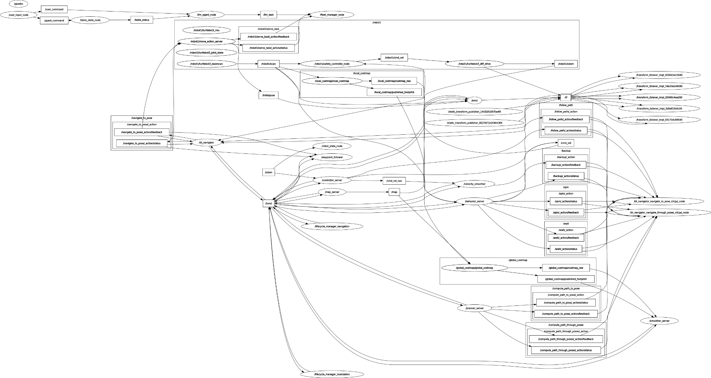
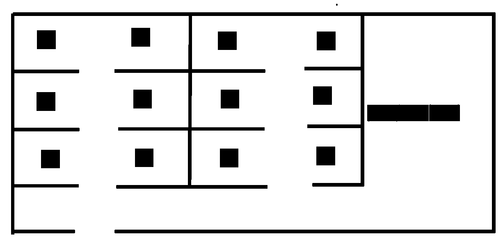
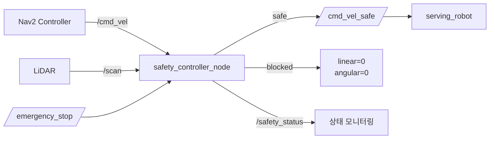

# Robotics-AI-3 - LLM Serving Robot

ROS 2, Gazebo, Nav2, LLM Agent를 이용해 가상의 식당 맵에서 동작하는 서빙 로봇을 구현한 프로젝트입니다. 사용자가 텍스트 또는 음성으로 자연어 명령을 입력하면, 시스템이 테이블 상태와 메뉴 정보를 반영해 주문을 구조화하고 로봇이 주방과 테이블 사이를 이동하며 서빙 시나리오를 수행합니다.

이 README는 프로젝트 발표와 평가 기준 설명을 바로 할 수 있도록 시스템 구조, 프롬프트 설계, ROS 2 통신, 안정성 로직, 데모 절차를 중심으로 정리했습니다.

## 핵심 기능

- 텍스트/음성 입력 기반 자연어 명령 수신
- 손님 입장, 퇴장, 테이블 상태 관리
- LLM 기반 주문 파싱 및 JSON 구조화
- 메뉴/테이블 점유 상태 기반 hallucination 필터링
- 주문을 로봇 액션 시퀀스로 변환
- Gazebo 식당 월드에서 Nav2 기반 자율주행
- LiDAR 기반 속도 안전 필터 및 비상 정지 서비스

## 프로젝트 구조

```text
Robotics-AI-3/
├── README.md
├── LICENSE
└── llm_serving_project_ws/
    └── src/
        ├── llm_serving_msgs/
        │   ├── msg/
        │   │   ├── RobotState.msg
        │   │   └── TableStatus.msg
        │   ├── srv/
        │   │   ├── SeatGuests.srv
        │   │   └── LeaveTable.srv
        │   └── action/
        │       └── ServeTask.action
        ├── llm_serving_core/
        │   ├── config/
        │   │   ├── restaurant_map.yaml
        │   │   └── menu_list.yaml
        │   ├── prompts/
        │   │   └── system_prompt.txt
        │   ├── launch/
        │   │   └── core_system.launch.py
        │   └── llm_serving_core/
        │       ├── user_input_node.py
        │       ├── llm_agent_node.py
        │       ├── task_executor_node.py
        │       ├── table_state_node.py
        │       ├── robot_state_node.py
        │       ├── speech_input.py
        │       ├── guest_command_parser.py
        │       └── order_command_parser.py
        └── llm_serving_gazebo/
            ├── worlds/
            │   └── RoboRestaurant__.world
            ├── models/
            │   └── serving_robot/model.sdf
            ├── maps/
            │   ├── map.yaml
            │   └── map.pgm
            ├── config/
            │   └── nav2_params.yaml
            ├── launch/
            │   ├── sim_environment.launch.py
            │   └── navigation.launch.py
            └── llm_serving_gazebo/
                ├── move_action_server.py
                └── safety_controller_node.py
```

## 시스템 아키텍처

```mermaid
flowchart LR
    U["User<br/>text / voice"] --> IN["user_input_node"]
    IN -->|Topic: /user_command| LLM["llm_agent_node"]
    IN -->|Topic: /guest_command| TABLE["table_state_node"]

    TABLE -->|Topic: /table_status| LLM
    TABLE -->|Topic: /table_assignment| GREET["optional greeting flow"]

    LLM -->|Topic: /llm_task<br/>structured JSON| EXEC["task_executor_node"]
    EXEC -->|Action: /serve_task| MOVE["move_action_server"]
    MOVE -->|Action: /navigate_to_pose| NAV2["Nav2"]

    NAV2 -->|Topic: /cmd_vel| SAFE["safety_controller_node"]
    LIDAR["LaserScan /scan"] --> SAFE
    SAFE -->|Topic: /cmd_vel_safe| GZ["Gazebo serving_robot"]
    GZ -->|Topic: /odom| STATE["robot_state_node"]
    STATE -->|Topic: /robot_status| ROS["ROS 2 system state"]
```



### 패키지 역할

| 패키지 | 역할 |
| --- | --- |
| `llm_serving_msgs` | 프로젝트 공통 인터페이스 정의. 테이블 상태, 로봇 상태, 손님 배정 서비스, 서빙 액션을 제공 |
| `llm_serving_core` | 사용자 입력, LLM Agent, 테이블 상태 관리, 주문 실행 요청, 로봇 상태 발행 |
| `llm_serving_gazebo` | Gazebo 식당 월드, 로봇 모델, Nav2 실행, 서빙 Action Server, 안전 제어 |

## 주요 노드와 통신

| 노드 | 입력 | 출력 | 역할 |
| --- | --- | --- | --- |
| `user_input_node` | 터미널 텍스트, push-to-talk 음성 | `/user_command`, `/guest_command` | 사용자 자연어 입력을 주문 명령과 손님 상태 명령으로 분리 |
| `table_state_node` | `/guest_command`, `/seat_guests`, `/leave_table` | `/table_status`, `/table_assignment` | 테이블별 손님 수를 단일 소유자로 관리 |
| `llm_agent_node` | `/user_command`, `/table_status` | `/llm_task` | LLM 호출, JSON 파싱, 메뉴/테이블 검증 |
| `task_executor_node` | `/llm_task` | `/serve_task` Action Goal | 구조화된 주문을 서빙 액션으로 전달 |
| `move_action_server` | `/serve_task`, `/greeting_move_goal` | `/navigate_to_pose`, Action feedback/result | 주방 이동, 주문 알림, 테이블 이동, 전달, 복귀 시퀀스 실행 |
| `safety_controller_node` | `/scan`, `/cmd_vel`, `/emergency_stop` | `/cmd_vel_safe`, `/safety_status` | 장애물, stale command, 수동 비상 정지 기반 속도 필터 |
| `robot_state_node` | `/odom` | `/robot_status` | 로봇 위치, 배터리, 적재 상태 발행 |

### Topic / Service / Action 사용 기준

| 통신 방식 | 사용 위치 | 선택 이유 |
| --- | --- | --- |
| Topic | `/user_command`, `/guest_command`, `/table_status`, `/robot_status`, `/safety_status` | 지속적으로 변하거나 이벤트처럼 흘러가는 상태/명령을 비동기적으로 공유 |
| Service | `/seat_guests`, `/leave_table`, `/emergency_stop` | 성공 여부와 메시지가 즉시 필요한 단발성 요청 처리 |
| Action | `/serve_task`, `/navigate_to_pose` | 이동처럼 시간이 오래 걸리고 feedback, cancel, result가 필요한 작업 처리 |

## LLM & Prompt 설계

## 시스템 구조도 및 맵 이미지

본 프로젝트의 ROS 2 노드/토픽 구조와 Gazebo 식당 맵 이미지는 아래와 같습니다.

### ROS 2 Node Graph



위 구조도는 사용자 입력, LLM Agent, 테이블 상태 관리, 태스크 실행, Gazebo 이동 제어 노드가 ROS 2 Topic, Service, Action을 통해 어떻게 연결되는지 보여줍니다.

사용자 입력은 `user_input_node`를 통해 명령 토픽으로 전달됩니다.  
음식 주문과 관련된 자연어 명령은 `llm_agent_node`가 처리하고, 손님 입장 및 퇴장과 같은 테이블 상태 명령은 `table_state_node`가 처리합니다.

`llm_agent_node`는 사용자 명령을 LLM을 통해 JSON 형태의 주문 정보로 구조화한 뒤 `/llm_task` 토픽으로 발행합니다.  
이후 `task_executor_node`가 해당 작업을 받아 서빙 액션으로 변환하고, `move_action_server`와 Nav2 이동 구조를 통해 로봇 이동 흐름으로 연결됩니다.

### Restaurant Map



위 맵은 Gazebo/Nav2에서 사용하는 식당 환경입니다.  
흰색 영역은 로봇이 이동 가능한 공간이고, 검정색 영역은 벽, 테이블, 카운터 등 로봇이 이동할 수 없는 장애물 영역입니다.

초기 `restaurant_map.yaml`에서는 일부 테이블 좌표가 로봇이 실제로 도착해야 하는 위치가 아니라, 테이블 또는 장애물이 존재하는 검정색 영역 기준으로 설정되어 있었습니다.  
이로 인해 Nav2 goal을 보냈을 때 목표 지점이 occupied area 위에 위치하게 되었고, 경로 생성을 실패하면서 `ABORTED` 상태가 반환되었습니다.

따라서 테이블 중심 좌표를 그대로 Nav2 goal로 사용하는 것이 아니라, 테이블 앞의 이동 가능한 흰색 영역에 별도의 접근 좌표를 설정해야 합니다.

[`llm_serving_gazebo/worlds/RoboRestaurant__.world`](llm_serving_project_ws/src/llm_serving_gazebo/worlds/RoboRestaurant__.world) 를 사용합니다.

LLM 시스템 프롬프트는 다음 파일에서 관리합니다.

```text
llm_serving_project_ws/src/llm_serving_core/prompts/system_prompt.txt
```

프롬프트는 LLM에게 다음 정보를 명확히 제공합니다.

- 역할: 식당 서빙 로봇 컨트롤러
- 수행 가능한 API: `order` 또는 `unknown` JSON 액션
- 출력 형식: markdown 없이 JSON only
- 필수 필드: `action`, `table`, `destination`, `items`, `reason`
- 메뉴 목록: `coke`, `water`, `orange_juice`, `burger`, `pizza`, `salad`, `ice_cream`, `cake`
- 테이블 규칙: 손님이 있는 테이블만 주문 가능
- 모호하거나 불가능한 명령은 `unknown`으로 거절

`llm_agent_node`는 매 사용자 명령마다 `table_state_node`에서 받은 현재 테이블 점유 상태를 프롬프트에 추가로 주입합니다.

```text
## Current Tables
- table_1: 2 guests
- table_2: empty
- ...
```

즉, LLM은 단순히 문장만 보는 것이 아니라 현재 식당 상태를 함께 보고 주문 가능 여부를 판단합니다.

### 구조화 출력 예시

사용자 입력:

```text
1번 테이블, 버거랑 콜라 주세요
```

LLM 출력:

```json
{
  "action": "order",
  "table": 1,
  "destination": "kitchen",
  "items": ["burger", "coke"],
  "reason": ""
}
```

이 JSON은 `/llm_task` Topic으로 발행되고, `task_executor_node`가 `ServeTask` Action Goal로 변환합니다.

### 태스크 플래닝 흐름

복잡한 자연어 명령은 다음 단계로 분해됩니다.

1. 사용자 자연어 입력 수신
2. 손님 상태 명령이면 규칙 파서가 `/guest_command`로 분기
3. 주문 명령이면 LLM이 테이블 번호와 메뉴를 JSON으로 구조화
4. LLM 출력 검증
5. `ServeTask` Action Goal 생성
6. `move_action_server`가 서빙 하위 액션 시퀀스 실행

서빙 하위 액션 시퀀스:

```text
navigating_to_kitchen
→ announcing_order
→ navigating_to_table
→ delivering_order
→ returning_home
```

이 방식은 LLM이 자연어 이해와 구조화에 집중하고, 실제 로봇 동작 순서는 ROS 2 Action Server가 결정적으로 실행하게 만들어 데모 안정성을 높입니다.

## 안정성 설계

### LLM 예외 처리

`llm_agent_node`는 LLM 응답이 잘못되어도 시스템이 중단되지 않도록 다음 방어 로직을 포함합니다.

- OpenAI `response_format={"type": "json_object"}` 사용
- temperature `0`으로 출력 변동성 최소화
- markdown code fence가 섞여도 JSON 부분만 추출
- `json.JSONDecodeError` 발생 시 로그만 남기고 task 발행 중단
- action이 `order`가 아니면 `unknown` 처리
- 없는 메뉴, 빈 테이블, 잘못된 테이블 번호, 빈 주문을 필터링
- OpenAI API 키가 없거나 API 호출 실패 시 규칙 기반 스텁 파서로 fallback

`task_executor_node`와 `move_action_server`도 한 번 더 검증합니다.

- 잘못된 task JSON 무시
- 이미 작업 중이면 새 task 무시
- Action Server가 없으면 안전하게 실패 처리
- table number가 없거나 items가 비어 있으면 goal reject
- Nav2 goal timeout/cancel/failure를 Action result로 반환

### 로봇 안전 제어



`safety_controller_node`는 Nav2가 발행한 `/cmd_vel`을 바로 로봇에 전달하지 않고 안전 필터를 거쳐 `/cmd_vel_safe`로 전달합니다.

```text
Nav2 /cmd_vel
→ safety_controller_node
→ /cmd_vel_safe
→ Gazebo planar_move plugin
```

안전 조건:

- 전방 `90도` LiDAR 영역 감시
- 장애물 거리 `0.35m` 미만이면 정지
- `0.45m` 이상 확보되면 재개
- `/scan`이 `1.0초` 이상 갱신되지 않으면 정지
- 움직임 명령이 stale 상태이면 정지 명령 반복 발행
- `/emergency_stop` 서비스로 수동 비상 정지 가능
- `/safety_status` Topic으로 현재 안전 상태 JSON 발행

수동 비상 정지:

```bash
ros2 service call /emergency_stop std_srvs/srv/SetBool "{data: true}"
ros2 service call /emergency_stop std_srvs/srv/SetBool "{data: false}"
```

Nav2 설정에서도 local/global costmap의 obstacle layer와 inflation layer를 사용해 경로 계획 단계의 충돌 회피를 함께 수행합니다.

## 실행 방법

### 1. 빌드

```bash
cd Robotics-AI-3/llm_serving_project_ws
colcon build --symlink-install
source install/setup.bash
```

LLM API를 사용할 경우 워크스페이스 또는 프로젝트 상위 경로에 `.env` 파일을 생성합니다.

```text
OPENAI_API_KEY=sk-...
```

API 키가 없으면 시스템은 규칙 기반 스텁 모드로 동작합니다. 이 경우에도 기본 주문 데모는 가능합니다.

### 2. Gazebo + Nav2 + 안전 제어 실행

터미널 1:

```bash
cd Robotics-AI-3/llm_serving_project_ws
source install/setup.bash
ros2 launch llm_serving_gazebo sim_environment.launch.py
```

실행되는 구성:

- Gazebo `RoboRestaurant__.world`
- `serving_robot` 모델 spawn
- Nav2 bringup
- `safety_controller_node`
- `move_action_server`

### 3. LLM Core 시스템 실행

터미널 2:

```bash
cd Robotics-AI-3/llm_serving_project_ws
source install/setup.bash
ros2 launch llm_serving_core core_system.launch.py input_mode:=text
```

음성 입력을 함께 사용할 경우:

```bash
ros2 launch llm_serving_core core_system.launch.py input_mode:=both
```

음성 모드는 `SpeechRecognition`, `PyAudio`, 마이크 입력 환경이 필요합니다.

## 데모 시나리오

### 🎥 시연 영상
[시연 영상: 로봇 네비게이션 및 서빙 시나리오](docs/robot_nav2.mp4)

*(참고: 위 링크를 클릭하면 Gazebo 환경에서 로봇이 주방에서 출발해 테이블로 이동하고 복귀하는 과정을 확인할 수 있습니다.)*

### 시나리오 1: 손님 입장 후 주문 서빙

터미널 2의 `user_input_node` 입력창에 다음 순서로 입력합니다.

```text
손님 2명 입장
테이블 상태
1번 테이블, 버거랑 콜라 주세요
```

예상 흐름:

1. `table_state_node`가 2명을 빈 테이블에 배정
2. `/table_status`가 갱신됨
3. LLM이 주문 문장을 JSON으로 변환
4. `task_executor_node`가 `/serve_task` Action Goal 전송
5. 로봇이 주방으로 이동
6. 주방에서 주문 내용을 출력
7. 로봇이 1번 테이블로 이동
8. 주문 전달 후 home 위치로 복귀

### 시나리오 2: 모호하거나 불가능한 주문 방어

```text
비어있는 3번 테이블에 피자 주세요
1번 테이블에 라면 주세요
테이블 번호 없이 콜라 주세요
```

예상 결과:

- 빈 테이블 주문은 거절
- 메뉴에 없는 음식은 거절
- 테이블이 모호한 경우 `unknown` 처리
- 시스템은 종료되지 않고 다음 명령을 계속 대기

### 시나리오 3: 비상 정지

터미널 3:

```bash
cd Robotics-AI-3/llm_serving_project_ws
source install/setup.bash
ros2 topic echo /safety_status
```

터미널 4:

```bash
cd Robotics-AI-3/llm_serving_project_ws
source install/setup.bash
ros2 service call /emergency_stop std_srvs/srv/SetBool "{data: true}"
```

예상 결과:

- `/safety_status`에 `manual_emergency_stop` 표시
- `/cmd_vel_safe`에 정지 명령 발행
- 로봇 이동 중에도 즉시 정지

## 설정 파일

### 식당 맵 좌표

```text
llm_serving_project_ws/src/llm_serving_core/config/restaurant_map.yaml
```

현재 설정:

- 주방: `kitchen`
- 복귀 위치: `home`
- 테이블: `table_1`부터 `table_12`
- 테이블별 최대 좌석 수 포함

`move_action_server`와 `table_state_node`는 같은 YAML을 읽기 때문에 테이블 좌표와 수용 인원 기준을 한 곳에서 관리할 수 있습니다.

### 메뉴 목록

```text
llm_serving_project_ws/src/llm_serving_core/config/menu_list.yaml
```

현재 메뉴:

- 음료: `coke`, `water`, `orange_juice`
- 음식: `burger`, `pizza`, `salad`
- 디저트: `ice_cream`, `cake`

LLM 출력에 이 목록 밖의 메뉴가 포함되면 `llm_agent_node`가 주문을 거절합니다.

## 평가 기준 매핑

| 평가 항목 | 프로젝트 구현 근거 |
| --- | --- |
| LLM 컨텍스트 및 구조화 | 시스템 프롬프트, 메뉴 YAML, 현재 테이블 점유 상태를 LLM에 주입하고 JSON only 출력 강제 |
| 태스크 플래닝 | 자연어 주문을 `order` JSON으로 구조화한 뒤 `주방 이동 → 주문 알림 → 테이블 이동 → 전달 → 복귀` 시퀀스로 실행 |
| ROS 2 아키텍처 | 입력, LLM, 상태 관리, task 실행, 이동 Action Server, 안전 제어 노드로 역할 분리 |
| Topic/Service/Action 활용 | 지속 상태는 Topic, 단발 요청은 Service, 장시간 이동/서빙은 Action으로 분리 |
| LLM 예외 처리 | JSON 파싱 실패, unknown action, 빈 테이블, 없는 메뉴, API 실패 fallback 방어 |
| 로봇 안전 제어 | LiDAR 기반 전방 장애물 정지, scan/cmd watchdog, manual emergency stop, Nav2 costmap |
| 시연 완성도 | launch 파일로 Gazebo/Nav2/Core 시스템을 재현 가능하게 실행 |
| 문서화 | 구조도, 프롬프트 설계, 통신 표, 데모 시나리오, 트러블슈팅 정리 |

## 트러블슈팅 기록

| 문제 | 원인 | 해결 |
| --- | --- | --- |
| LLM이 markdown 또는 설명 문장을 함께 출력 | 자유 형식 응답의 불안정성 | JSON response format, system prompt의 JSON only 규칙, code fence 제거 로직 적용 |
| 빈 테이블 주문이 실행될 위험 | 자연어만 보면 현재 테이블 상태를 알 수 없음 | `/table_status`를 LLM 컨텍스트에 주입하고 후처리에서 guest count 재검증 |
| 존재하지 않는 메뉴를 LLM이 만들어냄 | LLM hallucination | `menu_list.yaml`의 valid item set과 비교해 없는 메뉴 거절 |
| API 키가 없으면 데모가 막힘 | 외부 API 의존성 | `.env` 탐색 로직과 규칙 기반 stub fallback 구현 |
| 이동 도중 새 주문이 겹침 | Action 중복 실행 가능성 | `task_executor_node`의 busy flag와 `move_action_server`의 navigation lock 사용 |
| Nav2가 준비되기 전 goal 전송 | Action Server 준비 시간 필요 | `wait_for_server`와 timeout 실패 처리 적용 |
| 장애물 또는 센서 끊김 상황 | 실제 로봇 속도 명령은 계속 들어올 수 있음 | safety controller가 scan timeout, cmd timeout, obstacle distance를 감시해 정지 명령 발행 |

## 발표 요약

이 프로젝트의 핵심은 LLM을 로봇에 직접 연결하지 않고, ROS 2 시스템 안에서 검증 가능한 구조화 명령으로 변환한 뒤 Action Server가 실제 로봇 행동을 수행하게 만든 점입니다. LLM은 자연어 이해와 주문 구조화에 사용하고, 테이블 상태, 메뉴 검증, 이동 순서, 안전 정지는 ROS 2 노드가 책임지도록 분리했습니다. 덕분에 LLM 출력이 불안정하거나 API가 실패해도 시스템이 멈추지 않고, Gazebo/Nav2 환경에서 반복 가능한 서빙 데모를 수행할 수 있습니다.
